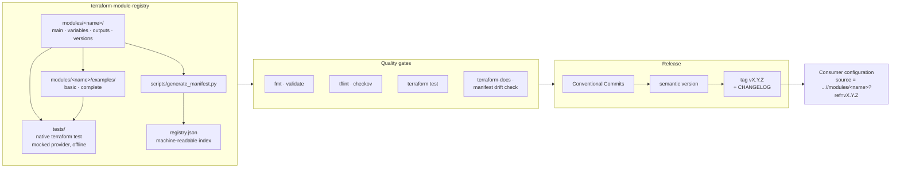

# terraform-module-registry

A private library of hardened, reusable Terraform modules. Each module ships
**secure defaults** so that a minimal call produces a well-configured, locked-down
resource — no extra flags required to be safe.

Consumers pin an immutable release tag and reference a module by subdirectory:

```hcl
module "logs" {
  source = "github.com/<your-github-org>/terraform-module-registry//modules/s3-bucket?ref=v1.0.0"

  bucket_name = "example-app-logs"
}
```

## How the registry fits together



## Design principles

- **Secure by default** — encryption, least privilege, and public-access blocking are on unless a caller explicitly opts out.
- **Small, composable modules** — one responsibility per module; compose them, don't fork them.
- **Input validation** — variables carry `validation` blocks so misconfiguration fails at plan time, not in production.
- **Documented contract** — every module has a README with an inputs/outputs table and runnable examples under `examples/`.
- **Versioned releases** — pin consumers to an immutable tag (`?ref=v1.0.0`), never `main`.

## Repository layout

| Path | Purpose |
|------|---------|
| `registry.json` | Machine-readable index of published modules (generated). |
| `modules/<name>/` | A module: `main.tf`, `variables.tf`, `outputs.tf`, `versions.tf`, `README.md`. |
| `modules/<name>/examples/` | Runnable example configurations. |
| `tests/` | Native Terraform test harness (`*.tftest.hcl`) run against a mocked provider. |
| `scripts/generate_manifest.py` | Generates `registry.json` from the module sources. |
| `docs/module-catalog.md` | Catalog of published modules and their contracts. |
| `.tflint.hcl` | tflint configuration for language and AWS linting. |
| `.checkov.yaml` | Checkov policy-scan configuration. |
| `.github/workflows/ci.yml` | Quality gates: fmt, validate, lint, scan, test, docs. |
| `Makefile` | Local entry points that mirror the quality gates. |
| `.releaserc.json`, `.commitlintrc.json`, `package.json` | Release automation and commit-message linting. |
| `CHANGELOG.md`, `RELEASING.md` | Release history and release process. |
| `CONTRIBUTING.md` | How to add or change a module. |
| `LICENSE` | MIT license. |

## Module catalog

| Module | Summary | Required inputs | Status |
|--------|---------|-----------------|--------|
| [`s3-bucket`](./modules/s3-bucket) | Hardened S3 bucket: encryption on, public access blocked, ACLs disabled, TLS enforced. | `bucket_name` | stable |
| [`vpc`](./modules/vpc) | Multi-AZ VPC: public/private subnets, per-AZ or single NAT, encrypted VPC Flow Logs. | `name`, `cidr_block`, `availability_zones` | stable |
| [`iam-role`](./modules/iam-role) | Reusable IAM role: service/account/OIDC trust, managed and inline policies, permissions boundary. | `role_name` | stable |

See [docs/module-catalog.md](./docs/module-catalog.md) for the full contract of
each module — security posture, key inputs, outputs, composition patterns, and a
selection guide.

## Getting started

```bash
git clone https://github.com/<your-github-org>/terraform-module-registry.git
cd terraform-module-registry

make help          # list every target
make validate      # init (no backend) + validate every module and example
make test          # native Terraform tests, offline against a mocked provider
```

A composed stack — a network, a bucket, and a role that can read from it — looks
like this:

```hcl
locals {
  registry = "github.com/<your-github-org>/terraform-module-registry//modules"

  tags = {
    Environment = "prod"
    Owner       = "platform"
  }
}

module "network" {
  source = "${local.registry}/vpc?ref=v1.0.0"

  name                 = "platform"
  cidr_block           = "10.0.0.0/16"
  availability_zones   = ["us-east-1a", "us-east-1b"]
  public_subnet_cidrs  = ["10.0.0.0/24", "10.0.1.0/24"]
  private_subnet_cidrs = ["10.0.10.0/24", "10.0.11.0/24"]

  tags = local.tags
}

module "artifacts" {
  source = "${local.registry}/s3-bucket?ref=v1.0.0"

  bucket_name = "example-platform-artifacts"
  tags        = local.tags
}

module "task_role" {
  source = "${local.registry}/iam-role?ref=v1.0.0"

  role_name                  = "example-platform-task"
  trusted_service_principals = ["ecs-tasks.amazonaws.com"]

  inline_policies = {
    artifacts-read = jsonencode({
      Version = "2012-10-17"
      Statement = [{
        Effect   = "Allow"
        Action   = ["s3:GetObject"]
        Resource = "${module.artifacts.bucket_arn}/*"
      }]
    })
  }

  tags = local.tags
}
```

Placeholders in examples — `<your-github-org>`, account id `123456789012`, and
`arn:aws:kms:...:123456789012:key/<key-id>` — are illustrative; substitute your
own values.

## Testing and quality gates

Every module is covered by native Terraform tests under [`tests/`](./tests).
They run with `command = plan` against a `mock_provider "aws"`, so the whole
suite executes offline — no credentials and no resources created. Positive runs
assert on plan-known values (outputs, configuration arguments, resource counts);
negative runs use `expect_failures` to confirm the input validations reject bad
configuration. A separate example-contract suite replays every published example
and asserts the topology and outputs that example advertises.

| Gate | Command | What it enforces |
|------|---------|------------------|
| Format | `make fmt-check` | Canonical `terraform fmt` formatting across the repository. |
| Validate | `make validate` | Every module and every example initializes and validates. |
| Lint | `make lint` | tflint language and AWS resource rules (`.tflint.hcl`). |
| Scan | `make scan` | Checkov security policy scan (`.checkov.yaml`). |
| Test | `make test` | Native module tests and example-contract tests. |
| Docs | `make docs-check` | terraform-docs renders, and `registry.json` matches the sources. |

`make ci` runs the whole set in the same order and with the same flags as
`.github/workflows/ci.yml`, so a green local run means a green pipeline run.

## Releasing and versioning

The registry is versioned as a whole and consumers pin an immutable tag
(`?ref=v1.0.0`), never `main`. Releases are automated from
[Conventional Commit](https://www.conventionalcommits.org/) messages: the commit
history determines the next [Semantic Version](https://semver.org/), the
changelog and module manifest are regenerated, and a tag and release are published.

`registry.json` is never edited by hand — it is generated from the module sources
by `scripts/generate_manifest.py`, which parses each module's providers, minimum
Terraform version, inputs, outputs, and examples.

```bash
make manifest        # regenerate registry.json after changing a module
make manifest-check  # verify the committed manifest matches the sources
make release-dry     # preview the next version without publishing anything
```

See [RELEASING.md](./RELEASING.md) for the version-bump rules and the full
release flow.

## Contributing

New modules and changes to existing ones follow the conventions in
[CONTRIBUTING.md](./CONTRIBUTING.md): secure defaults, validated inputs, a
documented contract, runnable examples, and test coverage for both the defaults
and the validations.

## License

MIT — see [LICENSE](./LICENSE).
